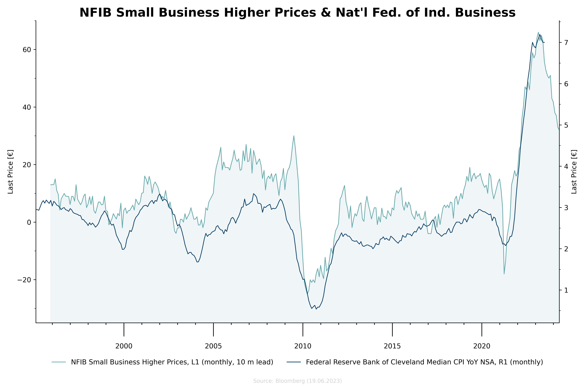

<p align="center">
    
</p>

The Charting Library is a Python library for generating customizable charts using Matplotlib. It provides a simple and intuitive way to create various types of charts, including line charts, bar charts, and scatter plots.

## Features


- Support for following chart types: line charts 
- Customizable axes, labels, and formatting options.
- Multiple y-axes support for displaying multiple series with different scales.
- Support for applying transformation functions to time series data.
- Save charts as PNG images.

## Available Transformers

- Invert 
- Average
- Lead
- Lag
- Resample

## Available Charts

- Time Series Chart

## Example

```python
# Data
df = pd.read_excel('nfib.xlsx', header=0, parse_dates=['Dates'], index_col='Dates')

# Create Chart
chart = TimeSeriesChart(title="NFIB Small Business Higher Prices & Nat'l Fed. of Ind. Business", num_y_axes=2)

# Configure y-axes
chart.configure_y_axis(axis_index=0, label="Last Price [€]", y_lim=(-35, 70), minor_locator=MultipleLocator(10))
chart.configure_y_axis(axis_index=1, label="Last Price [€]", minor_locator=MultipleLocator(0.5))

# Configure x-axis
major_locator = mdates.YearLocator(base=5)
minor_locator = mdates.YearLocator(base=1)
major_formatter = mdates.AutoDateFormatter(major_locator)
chart.configure_x_axis(major_formatter=major_formatter, minor_locator=minor_locator, major_locator=major_locator)

chart.configure_x_ticks(which='minor', length=3, width=1)
chart.configure_x_ticks(which='major', length=20, width=1, pad=10)

# Add data to the chart
chart.add_data(df.index, df['SBOIPRIC Index'], label="NFIB Small Business Higher Prices", y_axis=0, color="black", fill=True,
               fill_color='skyblue', fill_threshold=-35, transformer=[Resample('M'), Lead(window=timedelta(weeks=40))])
chart.add_data(df.index, df['CLEVCPIA Index'], label="Federal Reserve Bank of Cleveland Median CPI YoY NSA",
               y_axis=1, color="skyblue", transformer=Resample('M'))

# Set legend
chart.legend(frameon=False, ncol=2)

# Save the plot
chart.plot(path="output/example.png")
```

Ergebnis:




