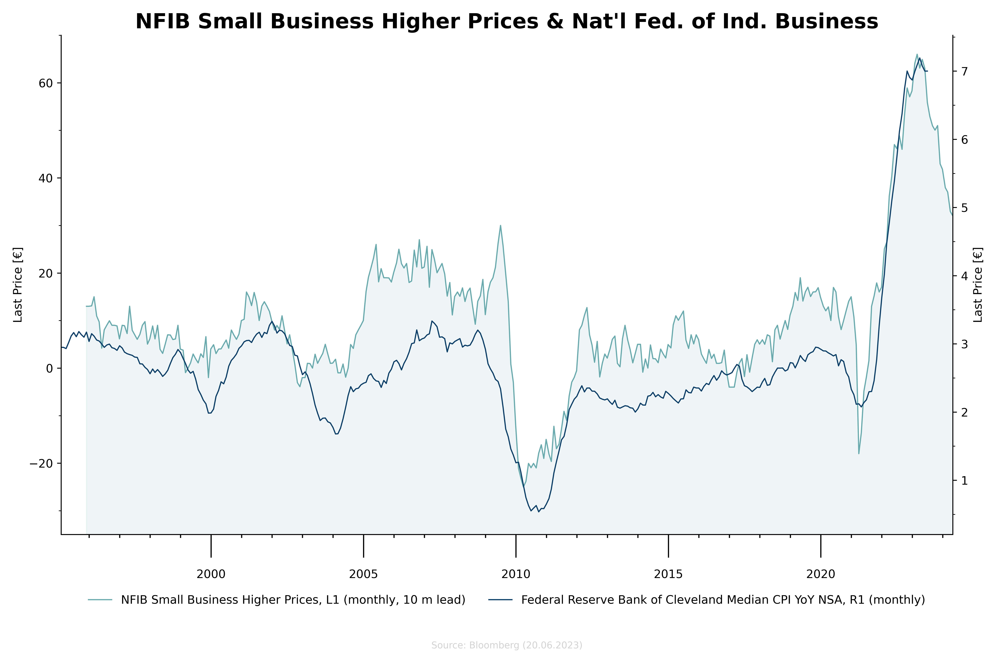
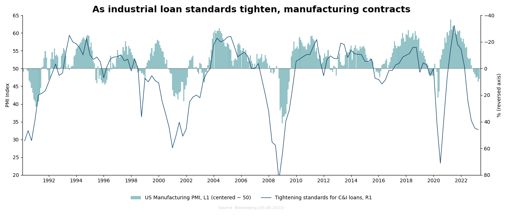
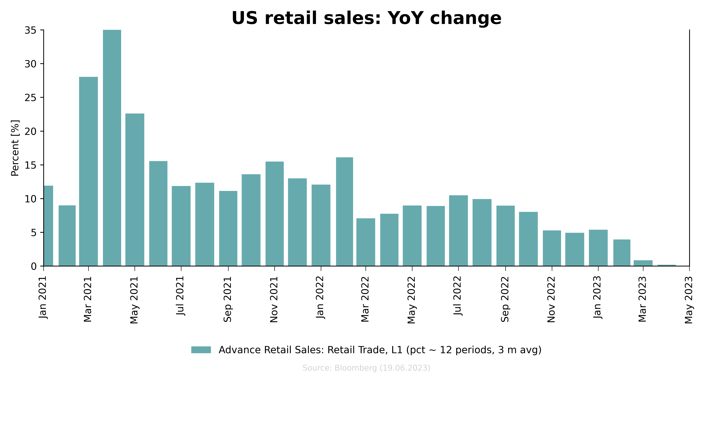

<p align="center">
    
</p>

The Charting Library is a Python library for generating customizable charts using Matplotlib. It provides a simple and intuitive way to create various types of charts, including line charts, bar charts, and scatter plots.

## Features

- Customizable axes, labels, and formatting options.
- Multiple y-axes support for displaying multiple series with different scales.
- Support for applying transformation functions to time series data.
- Save charts as PNG images.

## Available Transformers

- Invert 
- Average
- Lead
- Lag
- Resample

## Available Charts

- Time Series Chart
- Bar Chart

## Example 1

```python
df1, t1 = blp.get_series(series_id='SBOIPRIC Index', observation_start='19950131')
df2, t2 = blp.get_series(series_id='CLEVCPIA Index', observation_start='19950131')

chart = TimeSeriesChart(title="NFIB Small Business Higher Prices & Nat'l Fed. of Ind. Business", num_y_axes=2)

chart.configure_y_axis(axis_index=0, label="Last Price [€]", y_lim=(-35, 70), minor_locator=MultipleLocator(10))
chart.configure_y_axis(axis_index=1, label="Last Price [€]", minor_locator=MultipleLocator(0.5))

major_locator = mdates.YearLocator(base=5)
minor_locator = mdates.YearLocator(base=1)
major_formatter = mdates.AutoDateFormatter(major_locator)
chart.configure_x_axis(major_formatter=major_formatter, minor_locator=minor_locator, major_locator=major_locator)

chart.configure_x_ticks(which='minor', length=3, width=1)
chart.configure_x_ticks(which='major', length=20, width=1, pad=10)

chart.add_data(x=df1.index, y=df1['y'], label=t1, y_axis=0, fill=True,
               fill_threshold=-35, transformer=[Resample('M'), Lead(offset=DateOffset(months=10))])
chart.add_data(x=df2.index, y=df2['y'], label=t2, y_axis=1,  transformer=Resample('M'))

chart.legend(frameon=False, ncol=2)
chart.plot(path="output/cpi.png")
```

Result:



## Example 2

```python
d1, t1 = fred.get_series(series_id='DRTSCILM')  # DRTSCILM
d2, t2 = fred.get_series(series_id='JHDUSRGDPBR')  # USRINDEX Index
d3, t3 = blp.get_series(series_id='NAPMPMI Index', observation_start=19900131)

chart = TimeSeriesChart(title="As industrial loan standards tighten, manufacturing contracts",
                        figsize=(14, 6), num_y_axes=2)

chart.configure_y_axis(axis_index=0, label="PMI Index", y_lim=(20, 65))
chart.configure_y_axis(axis_index=1, label="%", y_lim=(80, -40), invert_axis=True)

major_locator = mdates.YearLocator(base=2)
major_formatter = mdates.AutoDateFormatter(major_locator)
chart.configure_x_axis(major_formatter=major_formatter, major_locator=major_locator)

chart.add_data(x=d1.index, y=d1['y'], label="Tightening standards for C&I loans", y_axis=1)
chart.add_data(x=d3.index, y=d3['y'], label=t3, chart_type='bar',
               y_axis=0, bar_bottom=50, transformer=Center(val=50), alpha=0.7)
chart.add_vertical_line(x=d2.index, y=d2["y"], label="US Recession")
chart.add_horizontal_line(y=0, axis_index=1)

chart.legend(frameon=False, ncol=3)
chart.plot(path="output/loan.png")
```

Result:



## Example 3:

```python
d1, t1 = fred.get_series(series_id='RSAFS', observation_start="2020-01-01")

chart = TimeSeriesChart(title="US retail sales: YoY change",
                        figsize=(10, 6), num_y_axes=1)

major_locator = mdates.MonthLocator(interval=2)
major_formatter = mdates.DateFormatter(fmt="%b %Y")
chart.configure_x_axis(major_formatter=major_formatter, major_locator=major_locator)
chart.configure_x_ticks(length=5, pad=5, rotation=90)

chart.configure_y_axis(axis_index=0, label="%", y_lim=(0, 35))

chart.add_data(x=d1.index, y=d1['y'], label=t1, chart_type='bar',
               y_axis=0, bar_bottom=0, transformer=[Pct(periods=12), Avg(offset=DateOffset(months=3))])

chart.legend(frameon=False, ncol=1, bbox_to_anchor=(0.5, -0.3))
chart.plot(path="output/retail.png")
```

Result:



