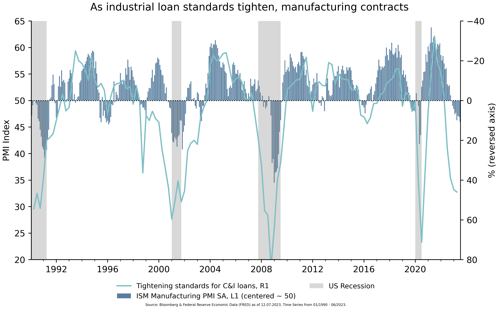
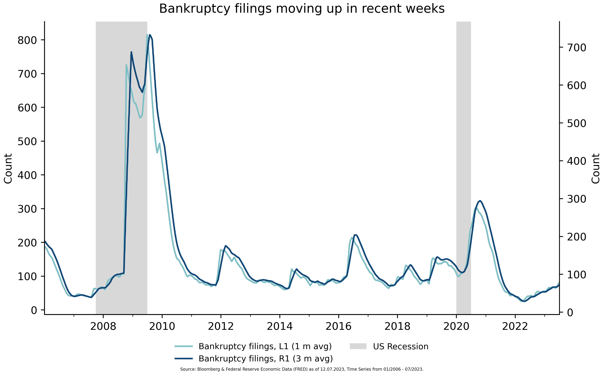

<p align="center">
    
</p>

The Charting Library is a Python library for generating customizable charts using Matplotlib. It provides a simple and intuitive way to create various types of charts, including line charts, bar charts, and scatter plots.

## Update Charts

To update all chart, just execute the [main](charting/update.py) script in `charting.update` module.

## Features

- Customizable axes, labels, and formatting options.
- Multiple y-axes support for displaying multiple series with different scales.
- Support for applying transformation functions to time series data.
- Save charts as PNG images.
- Tag images with metadata

## Available Transformers

- Invert 
- Pct
- Center
- Average
- Lead
- Lag
- Resample

## Available Charts

- Time Series Charts
- Bar Charts
- Stacked Bar Charts
- Horizontal/Vertical Lines

## Metadata

Each chart can be tagged with metadata to store it in a database. 
Therefor you need to add the metadata to the chart:

```python
title = "US Weekly Bankruptcies"

metadata = Metadata(title=title, country=Country.US, category=Category.CREDIT)
chart = Chart(title=title, metadata=metadata, filename="us_weekly_bankruptcy.png", language=kwargs.get('language', 'en'))
```

If no metadata is needed for the image and this is only for development, 
it can simply be omitted. By default, these are `None`.

## Storage

All charts are stored on the OneDrive drive under the following link:

```
C:\Users\<username>\OneDrive - Donner Reuschel\General - Portfolio Management\Organisation Development\charts
```

Images without metadata end up sorted by user in the `development` folder.

Images with metadata are stored sorted by the metadata. In addition, these charts are written to a database 
that stores the following things:

```python
CREATE TABLE `chart` (
  `id` varchar(255) NOT NULL,
  `title` varchar(255) DEFAULT NULL,
  `last_update` datetime DEFAULT NULL,
  `path` varchar(255) DEFAULT NULL,
  `start` date DEFAULT NULL,
  `end` date DEFAULT NULL,
  `country` varchar(255) DEFAULT NULL,
  `category` varchar(255) DEFAULT NULL,
  `base64` mediumtext,
  PRIMARY KEY (`id`)
) ENGINE=InnoDB DEFAULT CHARSET=utf8mb3;
```

## Development Examples

### Example 1

```python
df1, t1 = blp.get_series(series_id='SBOIPRIC Index', observation_start='19950131')
df2, t2 = blp.get_series(series_id='CLEVCPIA Index', observation_start='19950131')

chart = Chart(title="NFIB Small Business Higher Prices & Nat'l Fed. of Ind. Business", num_y_axis=2,
              filename="cpi.png", language=kwargs.get('language', 'en'))

chart.configure_y_axis(y_axis_index=0, label="Last Price [€]", y_lim=(-35, 70), minor_locator=MultipleLocator(10))
chart.configure_y_axis(y_axis_index=1, label="Last Price [€]", minor_locator=MultipleLocator(0.5))

major_locator = mdates.YearLocator(base=5)
minor_locator = mdates.YearLocator(base=1)
major_formatter = mdates.AutoDateFormatter(major_locator)
chart.configure_x_axis(major_formatter=major_formatter, minor_locator=minor_locator, major_locator=major_locator)

chart.configure_x_ticks(which='minor', length=3, width=1)
chart.configure_x_ticks(which='major', length=10, width=1, pad=5)

chart.add_series(x=df1.index, y=df1['y'], label=t1, y_axis_index=0, fill=True,
                 fill_threshold=-35, transformer=[Resample('M'), Lead(offset=DateOffset(months=10))])
chart.add_series(x=df2.index, y=df2['y'], label=t2, y_axis_index=1,  transformer=Resample('M'))

chart.legend()
return chart.plot(upload_chart='observation_start' not in kwargs)
```

Result:


### Example 2

```python
d1, t1 = fred.get_series(series_id='DRTSCILM')
d2, t2 = fred.get_series(series_id='JHDUSRGDPBR')
d3, t3 = blp.get_series(series_id='NAPMPMI Index', observation_start=19900131)

chart = Chart(title="As industrial loan standards tighten, manufacturing contracts", num_y_axis=2,
              filename="loan.png", language=kwargs.get('language', 'en'))

chart.configure_y_axis(y_axis_index=0, label="PMI Index", y_lim=(20, 65))
chart.configure_y_axis(y_axis_index=1, label="Percentage Points", y_lim=(80, -40), invert_axis=True)

minor_locator = mdates.YearLocator(base=1)
major_locator = mdates.YearLocator(base=4)
major_formatter = mdates.AutoDateFormatter(major_locator)
chart.configure_x_axis(major_formatter=major_formatter, minor_locator=minor_locator, major_locator=major_locator)

chart.add_series(x=d1.index, y=d1['y'], label="Tightening standards for C&I loans", y_axis_index=1)
chart.add_series(x=d3.index, y=d3['y'], label=t3, chart_type='bar', y_axis_index=0, bar_bottom=50,
                 transformer=Center(val=50), alpha=0.7)
chart.add_vertical_line(x=d2.index, y=d2["y"], label="US Recession")
chart.add_horizontal_line(y_axis_index=1)

chart.legend(ncol=2)
return chart.plot(upload_chart='observation_start' not in kwargs)
```

Result:



### Example 3:

```python
title = "US retail sales: YoY change"

d1, t1 = fred.get_series(series_id='RSAFS', observation_start="2020-01-01")

chart = Chart(title=title, filename="retail.png", language=kwargs.get('language', 'en'))

minor_locator = mdates.MonthLocator(interval=1)
major_locator = mdates.MonthLocator(interval=3)
major_formatter = mdates.DateFormatter(fmt="%m/%Y")

chart.configure_x_axis(major_formatter=major_formatter, minor_locator=minor_locator, major_locator=major_locator)

chart.configure_y_axis(y_axis_index=0, label="Percentage Points", y_lim=(0, 35))

chart.add_series(x=d1.index, y=d1['y'], label=t1, chart_type='bar', bar_bottom=0,
                 transformer=[Pct(periods=12), Avg(offset=DateOffset(months=3))])

chart.legend()
return chart.plot(upload_chart='observation_start' not in kwargs)
```


### Example 4:

```python
d1, t1 = blp.get_series(series_id='BNKRINDX Index', observation_start="20060101")
d2, t2 = fred.get_series(series_id='JHDUSRGDPBR', observation_start="2006-01-01")

chart = Chart(title="Bankruptcy filings moving up in recent weeks", num_y_axis=2, filename="bankruptcy.png", language=kwargs.get('language', 'en'))

chart.configure_y_axis(y_axis_index=0, label="Count")
chart.configure_y_axis(y_axis_index=1, label="Count")

minor_locator = mdates.YearLocator(base=1)
major_locator = mdates.YearLocator(base=2)
major_formatter = mdates.DateFormatter("%Y")
chart.configure_x_axis(major_formatter=major_formatter, minor_locator=minor_locator, major_locator=major_locator)

chart.add_series(x=d1.index, y=d1['y'], label="Bankruptcy filings", y_axis_index=0,
                 transformer=Avg(offset=DateOffset(months=1)))
chart.add_series(x=d1.index, y=d1['y'], label="Bankruptcy filings", y_axis_index=1,
                 transformer=Avg(offset=DateOffset(months=3)))
chart.add_vertical_line(x=d2.index, y=d2["y"], label="US Recession")

chart.legend(ncol=2)
return chart.plot(upload_chart='observation_start' not in kwargs)
```



### Example 5:

```python
headline_df, headline_title = fred.get_series(series_id='CPIAUCSL', observation_start='2016-01-01')
core_df, core_title = fred.get_series(series_id='CPILFESL', observation_start='2016-01-01')

food_df, _ = blp.get_series(series_id='CPSFFOOD Index', observation_start='20160101')
x, y = Pct(periods=12).transform(food_df.index, food_df['y'])
food_df = DataFrame({'y': y}, index=x)
food_weights_df, _ = blp.get_series(series_id='CPIVFOOD Index', observation_start='20160101')
food_df['weighted'] = food_df['y'] * food_weights_df['y'].shift(12) / 100
food_df.index = food_df.index.to_period('M').to_timestamp(how='start')

energy_df, _ = blp.get_series(series_id='CPUPENER Index', observation_start='20160101')
energy_weights_df, _ = blp.get_series(series_id='CPIVENER Index', observation_start='20160101')
x, y = Pct(periods=12).transform(energy_df.index, energy_df['y'])
energy_df = DataFrame({'y': y}, index=x)
energy_df['weighted'] = energy_df['y'] * energy_weights_df['y'].shift(12) / 100
energy_df.index = energy_df.index.to_period('M').to_timestamp(how='start')

goods_df, _ = blp.get_series(series_id='CPUPCXFE Index', observation_start='20160101')
goods_weights_df, _ = blp.get_series(series_id='CPIVCLFE Index', observation_start='20160101')
x, y = Pct(periods=12).transform(goods_df.index, goods_df['y'])
goods_df = DataFrame({'y': y}, index=x)
goods_df['weighted'] = goods_df['y'] * goods_weights_df['y'].shift(12) / 100
goods_df.index = goods_df.index.to_period('M').to_timestamp(how='start')

services_df, _ = blp.get_series(series_id='CPUPSXEN Index', observation_start='20160101')
services_weights_df, _ = blp.get_series(series_id='CPIVSLES Index', observation_start='20160101')
x, y = Pct(periods=12).transform(services_df.index, services_df['y'])
services_df = DataFrame({'y': y}, index=x)
services_df['weighted'] = services_df['y'] * services_weights_df['y'].shift(12) / 100
services_df.index = services_df.index.to_period('M').to_timestamp(how='start')

chart = Chart(title="U.S. CPI by Component", filename="inflation.png", language=kwargs.get('language', 'en'))

chart.configure_y_axis(y_axis_index=0, label="Percentage Points", minor_locator=MultipleLocator(1), y_lim=(-2.5, 10))

major_locator = mdates.YearLocator(base=1)
minor_locator = mdates.MonthLocator(interval=2)
major_formatter = mdates.AutoDateFormatter(major_locator)
chart.configure_x_axis(major_formatter=major_formatter, minor_locator=minor_locator, major_locator=major_locator)

chart.configure_x_ticks(which='minor', length=3, width=1)
chart.configure_x_ticks(which='major', length=10, width=1, pad=5)

chart.add_horizontal_line(y_axis_index=0)

chart.add_series(x=headline_df.index, y=headline_df['y'], label="Headline YoY", transformer=Pct(periods=12), linewidth=2)
chart.add_series(x=core_df.index, y=core_df['y'], label="Core YoY", transformer=Pct(periods=12), linewidth=2)

chart.add_series(x=services_df.index, y=services_df['weighted'], chart_type='bar', stacked=True,
                 label="Services (Ex Food & Energy)")

chart.add_series(x=goods_df.index, y=goods_df['weighted'], chart_type='bar', stacked=True,
                 label="Goods (Ex Food & Energy)")

chart.add_series(x=food_df.index, y=food_df['weighted'], chart_type='bar', stacked=True, label="Food")

chart.add_series(x=energy_df.index, y=energy_df['weighted'], chart_type='bar', stacked=True, label="Energy")

chart.legend(ncol=2)
return chart.plot(upload_chart='observation_start' not in kwargs)
```


### Example 6:

```python
d0, t0 = fred.get_series(series_id='JHDUSRGDPBR', observation_start="2002-01-01")

d1, t1 = fred.get_series(series_id="JTSJOL", observation_start="2002-01-01")
d2, t2 = fred.get_series(series_id="JTS2300JOL", observation_start="2002-01-01")
d3, t3 = fred.get_series(series_id="JTS3000JOL", observation_start="2002-01-01")

chart = Chart(title="Job Openings", num_rows=3, num_y_axis=1, filename="job-openings.png", language=kwargs.get('language', 'en'))

chart.configure_y_axis(row_index=0, y_axis_index=0,
                       minor_locator=MultipleLocator(1000), major_locator=MultipleLocator(2000))

chart.configure_y_axis(row_index=1, y_axis_index=0,
                       minor_locator=MultipleLocator(50), major_locator=MultipleLocator(100))

chart.configure_y_axis(row_index=2, y_axis_index=0,
                       minor_locator=MultipleLocator(100), major_locator=MultipleLocator(200))

chart.add_sup_y_label(label="Level of Thousands")

major_locator = mdates.YearLocator(base=2)
minor_locator = mdates.YearLocator(base=1)
major_formatter = mdates.AutoDateFormatter(major_locator)

chart.configure_x_axis(major_formatter=major_formatter, minor_locator=minor_locator,
                       major_locator=major_locator)

chart.add_vertical_line(x=d0.index, y=d0["y"], row_index=[0, 1, 2], label="US Recession")

chart.add_series(d1.index, d1["y"], row_index=0, label=t1, fill=True, fill_threshold=2000)
chart.add_series(d2.index, d2["y"], row_index=1, label=t2, transformer=Center(val=250), fill=True, fill_threshold=0)
chart.add_series(d3.index, d3["y"], row_index=2, chart_type='bar', label=t3,
                 transformer=Resample(rule='Y'))

chart.legend(ncol=2)
return chart.plot(upload_chart='observation_start' not in kwargs)
```

